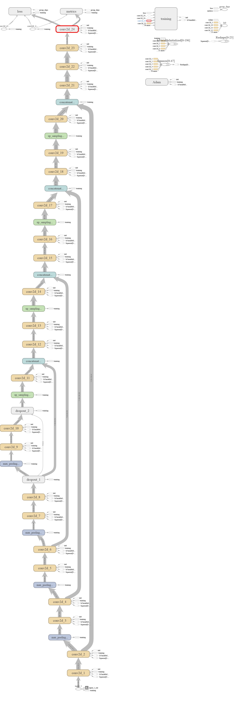
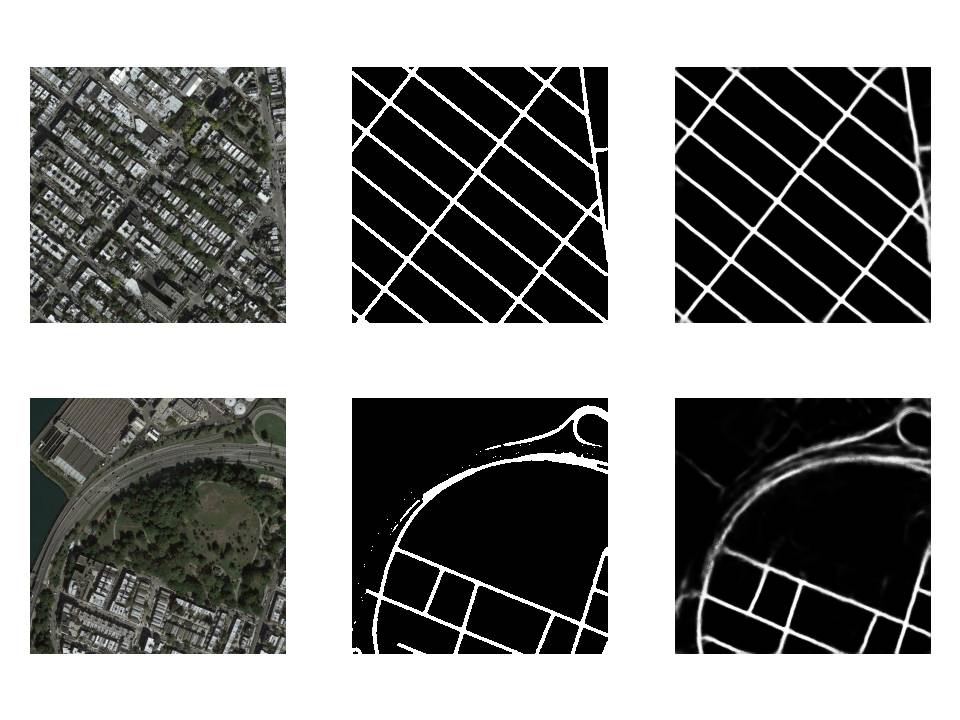

# U-Net-Satellite; Segmentation based road detection framework using Keras

The aim of this project is road detection from satellite images using a variant of deep Convolutional Neural Networks which is known as U-Net. The output of the model is a segmentation mask which differentiates roads from other terrains.
 
 
 ## Overview
 
 ### Model

U-net is an encoder-decoder type network architecture for image segmentation. The name of the architecture comes from its unique shape, where the feature maps from convolution part in downsampling step are fed to the up-convolution part in up-sampling step. 
This model is a slight modification of original U-Net architecture. The details of the architecture can be clearly seen in the notebook as the output of the "model.summary()" cell.

The TensorBoard graph is shown below:

### Data

The inputs are resized to 256x256 from the original size of 600x600. The ground truths are binarized version of the input satellite images. Images are separated into train and test sets and stored in separate h5 files for convenience. Training set consists of 2087 images and test set consists of 20 images.

### Training

The model was trained for 30 epochs and took about 3 hours on colab GPU. After 30 epochs, the training Dice score and Jaccard index were 0.8918 and  0.9754. Corresponding validation metrics were 0.7533 and 0.9527.
The training vs validation loss is shown below :

## Results

The following images show the comparison of the original satellite image, ground truth, and it's corresponding prediction:

## References

- Original paper: [Arxiv](https://arxiv.org/abs/1505.04597)
- Useful blogs: 
     - [Vehicle Detection](https://chatbotslife.com/small-u-net-for-vehicle-detection-9eec216f9fd6)
     - [Medical Image Segmentation](https://towardsdatascience.com/medical-image-segmentation-part-1-unet-convolutional-networks-with-interactive-code-70f0f17f46c6)
- Original Dataset: https://people.eecs.berkeley.edu/~tinghuiz/projects/pix2pix/datasets/maps.tar.gz
- Datasets used: https://drive.google.com/drive/folders/1_wBiTCBZ26F_NNpJshw5kwEHyaSeyzFC?usp=sharing

